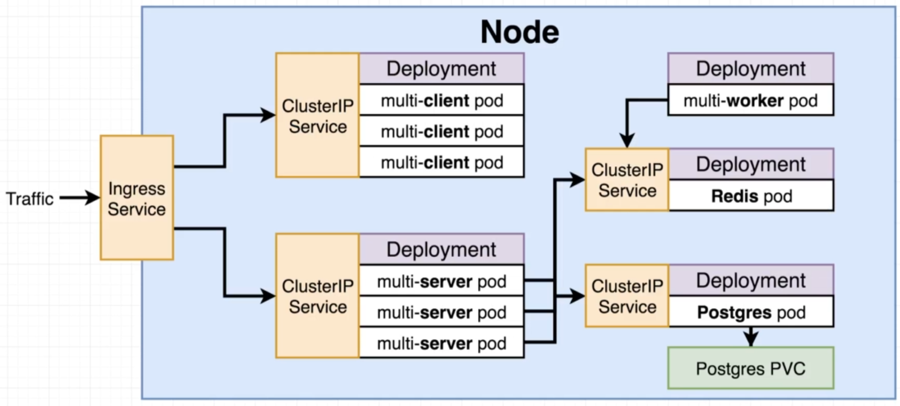

# Docker with Kubernetes

This is the same project of [docker-elastic-beanstalk](https://github.com/Moath-Zaghdad/docker-elastic-beanstalk) but we are using **Kubernetes** 

### Kubernetes architecture

##### ***NOTES***
 We need to manually setup a secret on the K8s Cluster
 - `kubectl create secret generic pgpassword --from-literal PGPASSWORD=<anyPostgresPassword>`

 We are using [NGINX Ingress Controller](https://github.com/kubernetes/ingress-nginx)
 - this is its [Dock](https://kubernetes.github.io/ingress-nginx/development/)
